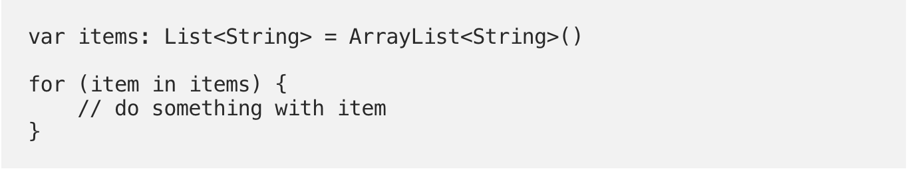
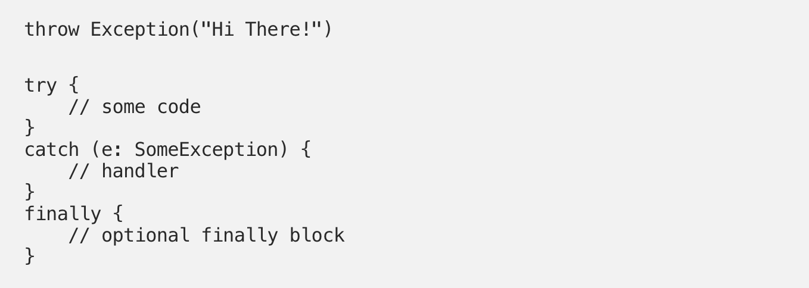

# NghienCuuKhoaHoc
+-----------------------------------------------------------------------+
| ĐẠI HỌC ĐÀ NẴNG                                                       |
|                                                                       |
| **PHÂN HIỆU ĐẠI HỌC ĐÀ NẴNG TẠI KON TUM**                             |
|                                                                       |
| **BÁO CÁO TỔNG KẾT**                                                  |
|                                                                       |
| **ĐỀ TÀI NGHIÊN CỨU KHOA HỌC CỦA SINH VIÊN**                          |
|                                                                       |
| **NĂM HỌC 2020 - 2021**                                               |
|                                                                       |
| **XÂY DỰNG ỨNG DỤNG TRA CỨU TIN TỨC CHO SINH VIÊN TRÊN HỆ ĐIỀU HÀNH   |
| ANDROID**                                                             |
|                                                                       |
| **Thuộc nhóm ngành khoa học: Công nghệ thông tin**                    |
|                                                                       |
| **Lương Văn Ý**                                                       |
|                                                                       |
| **Kon Tum, tháng 5 năm 2021**                                         |
+=======================================================================+
+-----------------------------------------------------------------------+

+-----------------------------------------------------------------------+
| ĐẠI HỌC ĐÀ NẴNG                                                       |
|                                                                       |
| **PHÂN HIỆU ĐẠI HỌC ĐÀ NẴNG TẠI KON TUM**                             |
|                                                                       |
| **BÁO CÁO TỔNG KẾT**                                                  |
|                                                                       |
| **ĐỀ TÀI NGHIÊN CỨU KHOA HỌC CỦA SINH VIÊN**                          |
|                                                                       |
| **NĂM HỌC 2020 - 2021**                                               |
|                                                                       |
| **XÂY DỰNG ỨNG DỤNG TRA CỨU TIN TỨC CHO SINH VIÊN TRÊN HỆ ĐIỀU HÀNH   |
| ANDROID**                                                             |
|                                                                       |
| Thuộc nhóm ngành khoa học: Công nghệ thông tin                        |
|                                                                       |
| Sinh viên thực hiện: Lương Văn Ý                                      |
|                                                                       |
| Nam, Nữ: Nam                                                          |
|                                                                       |
| Lớp, khoa: K12TT, Khoa Kỹ thuật - Nông nghiệp                         |
|                                                                       |
| Ngành học: Công nghệ thông tin                                        |
|                                                                       |
| Người hướng dẫn: ThS. Lê Thị Bảo Yến                                  |
|                                                                       |
| **Kon Tum, tháng 5 năm 2021**                                         |
+=======================================================================+
+-----------------------------------------------------------------------+

**MỤC LỤC**

[1. MỞ ĐẦU 1](#mở-đầu)

[1.1. Tổng quan về vấn đề nghiên cứu 1](#tổng-quan-về-vấn-đề-nghiên-cứu)

[1.2. Lý do chọn đề tài 2](#lý-do-chọn-đề-tài)

[1.3. Mục tiêu nghiên cứu 2](#mục-tiêu-nghiên-cứu)

[1.4. Phương pháp nghiên cứu 3](#phương-pháp-nghiên-cứu)

[1.5. Phạm vi nghiên cứu 3](#phạm-vi-nghiên-cứu)

[2. CƠ SỞ LÝ THUYẾT 3](#cơ-sở-lý-thuyết)

[2.1. Android 3](#android)

[2.1.1. Lịch sử của Android 3](#lịch-sử-của-android)

[2.1.2. Giới thiệu về hệ điều hành Android
5](#giới-thiệu-về-hệ-điều-hành-android)

[2.1.3. The Android Ecosystem 5](#the-android-ecosystem)

[2.1.4. Software Development kit 7](#software-development-kit)

[2.1.5. Kiến trúc của hệ điều hành Android
7](#kiến-trúc-của-hệ-điều-hành-android)

[2.1.6. Một số điều cơ bản về ứng dụng Android
9](#một-số-điều-cơ-bản-về-ứng-dụng-android)

[2.2. Kotlin 15](#kotlin)

[2.2.1. Giới thiệu Kotlin 15](#giới-thiệu-kotlin)

[2.2.2. Lý do chọn Kotlin 15](#lý-do-chọn-kotlin)

[2.2.3. Kotlin cơ bản 16](#kotlin-cơ-bản)

[2.3. Clean Architecture 23](#clean-architecture)

[2.3.1. Giới thiệu về Clean Architecture
23](#giới-thiệu-về-clean-architecture)

[2.3.2. Định nghĩa 24](#định-nghĩa)

[2.3.3. Kiến trúc Clean 24](#kiến-trúc-clean)

[2.3.4. Hai cốt lõi của kiến trúc Clean Architecture
25](#hai-cốt-lõi-của-kiến-trúc-clean-architecture)

[2.3.5. Tại sao Clean Architecture lại quan trọng
25](#tại-sao-clean-architecture-lại-quan-trọng)

[2.4. Gradle 25](#gradle)

[2.4.1. Lịch sử 25](#lịch-sử)

[2.4.2. Giới thiệu tổng quan về Gradle
26](#giới-thiệu-tổng-quan-về-gradle)

[2.4.3. Một số điều cần biết về Gradle
26](#một-số-điều-cần-biết-về-gradle)

[2.5. Firebase 28](#firebase)

[2.5.1. Giới thiệu Firebase 28](#giới-thiệu-firebase)

[2.5.2. Một số dịch vụ của Firebase 29](#một-số-dịch-vụ-của-firebase)

[2.5.3. Lý do chọn Firebase 38](#lý-do-chọn-firebase)

[3. PHÂN TÍCH VÀ THIẾT KẾ 39](#phân-tích-và-thiết-kế)

[3.1. Yêu cầu chức năng 39](#yêu-cầu-chức-năng)

[3.1.1. Nhận và hiển thị thông báo 39](#nhận-và-hiển-thị-thông-báo)

[3.1.2. Đăng nhập 39](#đăng-nhập)

[3.1.3. Hiển thị sơ bộ về trường 39](#hiển-thị-sơ-bộ-về-trường)

[3.1.4. Nhận thông báo theo kênh 39](#nhận-thông-báo-theo-kênh)

[3.1.5. Gửi thông báo 39](#gửi-thông-báo)

[3.1.6. Phi chức năng 39](#phi-chức-năng)

[3.2. Giải pháp 39](#giải-pháp)

[3.3. Phân tích và thiết kế hệ thống
41](#phân-tích-và-thiết-kế-hệ-thống)

[3.3.1. Kiến trúc của hệ thống 41](#kiến-trúc-của-hệ-thống)

[3.3.2. Sơ đồ luồng dữ liệu 46](#sơ-đồ-luồng-dữ-liệu)

[3.3.3. Sơ đồ Use-case: 48](#sơ-đồ-use-case)

[3.3.4. Sơ đồ tuần tự 49](#sơ-đồ-tuần-tự)

[3.3.5. Mô hình cơ sở dữ liệu 52](#mô-hình-cơ-sở-dữ-liệu)

[3.4. Công cụ sử dụng 52](#công-cụ-sử-dụng)

[4. DEMO ỨNG DỤNG 55](#demo-ứng-dụng)

[4.1. Icon của ứng dụng 55](#icon-của-ứng-dụng)

[4.2. Giao diện đăng nhập ứng dụng 56](#giao-diện-đăng-nhập-ứng-dụng)

[4.2.1. Giao diện chào mừng cho lần đầu đăng nhập
56](#giao-diện-chào-mừng-cho-lần-đầu-đăng-nhập)

[4.3. Giao diện chính của ứng dụng 57](#giao-diện-chính-của-ứng-dụng)

[4.4. Giao diện gửi thông báo 58](#giao-diện-gửi-thông-báo)

[4.5. Giao diện user 62](#giao-diện-user)

[4.6. Giao diện trang web Udck 63](#giao-diện-trang-web-udck)

[5. KẾT LUẬN VÀ KIẾN NGHỊ 67](#giao-diện-chức-năng-chia-sẻ-thông-báo)

[5.1. Kết luận 69](#kết-luận)

[5.2. Kiến nghị 69](#kiến-nghị)

**\
**

DANH MỤC HÌNH

[Hình 1: Hạn chế trong việc sử dụng một số công nghệ 1](#_Toc73084869)

[Hình 2: Lập trình MIDLet 4](#_Toc73084870)

[Hình 3: Android OS 5](#_Toc73084871)

[Hình 4: Hệ sinh thái Android được vẽ vào năm 2018 6](#_Toc73084872)

[Hình 5: Một số công cụ trong SDK hỗ trợ việc lập trình
7](#_Toc73084873)

[Hình 6: Kiến trúc hệ điều hành Android 8](#_Toc73084874)

[Hình 7: Mô tả ứng dụng Android khi chạy 11](#_Toc73084875)

[Hình 8: Tệp AndroidManifest.xml ứng dụng 13](#_Toc73084876)

[Hình 9: Ví dụ về AndroidManifest.xml 14](#_Toc73084877)

[Hình 10: Lập trình đa mô hình với Kotlin 15](#_Toc73084878)

[Hình 11: Ngôn ngữ lập trình Kotlin 16](#_Toc73084879)

[Hình 12: Kiểu số nguyên trong Kotlin 22](#_Toc73084880)

[Hình 13: Kiểu số thực trong Kotlin 22](#_Toc73084881)

[Hình 14: Kotlin visible modifier 23](#_Toc73084882)

[Hình 15: Kiến trúc clean 24](#_Toc73084883)

[Hình 16: Công cụ Gradle 26](#_Toc73084884)

[Hình 17: Hai ví dụ về đồ thị nhiệm vụ Gradle 27](#_Toc73084885)

[Hình 18: Sự khác biệt giữa các phát triển truyền thống và sử dụng
Firebase 29](#_Toc73084886)

[Hình 19: Một số dịch vụ mà Firebase cung cấp 29](#_Toc73084887)

[Hình 20: Firebase Auth đăng nhập bằng các dịch vụ nổi tiếng
30](#_Toc73084888)

[Hình 21: Quy tắc bảo mật được áp dụng trong Firebase 31](#_Toc73084889)

[Hình 22: Realtime database 32](#_Toc73084890)

[Hình 23: Bảng điều khiển realtime database 32](#_Toc73084891)

[Hình 24: Cloud Firestore 33](#_Toc73084892)

[Hình 25: Ví dụ về Firestore 34](#_Toc73084893)

[Hình 26: So sánh giữa Realtime và Firestore database 35](#_Toc73084894)

[Hình 27: Storage tại bẳng điều kiển của Firebase 36](#_Toc73084895)

[Hình 28: Google cloud Functions 36](#_Toc73084896)

[Hình 29: Kiến trúc của Cloud Messaging 37](#_Toc73084897)

[Hình 30: Firebase Console 38](#_Toc73084898)

[Hình 31: Một số thư viện được sử dụng trong ứng dụng 41](#_Toc73084899)

[Hình 32: Các module của hệ thống 41](#_Toc73084900)

[Hình 33: Domain Module 42](#_Toc73084901)

[Hình 34: Module data 43](#_Toc73084902)

[Hình 35: Module data firebase 43](#_Toc73084903)

[Hình 36: Module presentation 44](#_Toc73084904)

[Hình 37: Module app 45](#_Toc73084905)

[Hình 38: Luồng của cấu trúc 45](#_Toc73084906)

[Hình 39: Sơ đồ luồng dữ liệu mức ngữ cảnh 46](#_Toc73084907)

[Hình 40: Sơ đồ luồng dữ liệu mức đỉnh 47](#_Toc73084908)

[Hình 41: Sơ đồ Use-case 48](#_Toc73084909)

[Hình 42: Sơ đồ sequence cho login 49](#_Toc73084910)

[Hình 43: Sơ đồ sequence cho chức năng xem thông báo 50](#_Toc73084911)

[Hình 44: Sơ dồ sequence cho chức năng share 51](#_Toc73084912)

[Hình 45: Sơ đồ sequence cho chức năng gửi thông báo 51](#_Toc73084913)

[Hình 46: Sơ đồ cơ sở dữ liệu 52](#_Toc73084914)

[Hình 47: Công cụ Android studio 53](#_Toc73084915)

[Hình 48: Công cụ Firebase 53](#_Toc73084916)

[Hình 49: Công cụ máy ảo 54](#_Toc73084917)

[Hình 50: Icon ứng dụng 55](#_Toc73084918)

[Hình 51: Màn hình login chính 56](#_Toc73084919)

[Hình 52: Màn hình cho chào mừng 56](#_Toc73084920)

[Hình 53: Màn hình chính, cho phép xem thông báo 57](#_Toc73084921)

[Hình 54: Màn hình gửi thông báo 58](#_Toc73084922)

[Hình 55: Giao diện lỗi khi tài khoản không có đủ quyền trong hệ thống
59](#_Toc73084923)

[Hình 56: Màn hình lựa chọn đối tượng 60](#_Toc73084924)

[Hình 57: Dữ liệu sau khi được đẩy lên Firebase 61](#_Toc73084925)

[Hình 58: Màn hình thông báo 61](#_Toc73084926)

[Hình 59: Màn hình User 62](#_Toc73084927)

[Hình 60: Giao diện truy cập trang web UDCK 63](#_Toc73084928)

[Hình 61: Giao diện chọn đăng kí đối tượng để nhận thông tin
64](#_Toc73084929)

[Hình 62: Giao diện thông báo cá nhân 65](#_Toc73084930)

[Hình 63: Giao diện chức năng đổi ngôn ngữ 66](#_Toc73084931)

[Hình 64: Màn hình tính năng chia sẻ 67](#_Toc73084932)

[Hình 65: Màn hình xem chi tiết thông báo 68](#_Toc73084933)

**DANH SÁCH VIẾT TẮT**

UDCK: Phân hiệu đại học Đà Nẵng tại Kon Tum

OS: Operating system

# MỞ ĐẦU

## Tổng quan về vấn đề nghiên cứu 

Nhu cầu tìm kiếm thông tin là một nhu cầu tất yếu, nó ảnh hưởng rất lớn
đến cuộc sống hiện đại. Để đáp ứng nhu cầu đó, cùng với sự phát triển
của công nghệ đã giúp chúng ta có nhiều lựa chọn hơn trong việc tiếp
nhận thông tin. Đặt biệt hiện nay với sự phổ cập của điện thoại nói
riêng và sức mạnh của công nghệ di động nói chung, chúng ta có nhiều
cách dễ dàng hơn để tiếp cận và truy cứu đến nguồn thông tin vô tận.
Chính vì thế việc tận dụng những lợi thế trong thời đại số sẽ giúp cho
việc chia sẻ thông tin trở nên tuyệt vời hơn bao giờ hết, đặt biệt là
khi áp dụng trong một môi trường nhất định như trường học hay bệnh viện.
Mặc dù có những ưu điểm nhất định về tính di động và thiết kế, tuy nhiên
hiện nay việc truy cập thông tin trên điện thoại theo những cách truyền
thống như sử dụng mô hình trang web đang dần lộ ra 1 số hạn chế nhất
định. Nó bao gồm, thứ nhất là hạn chế trong việc sử dụng những công nghệ
như Flash, hiển thị tập file pdf... Chính điều này khiến cho việc đồng
bộ giữa các nền tảng cũng như bảo trì trở nên khó khăn hơn.

{width="6.263888888888889in"
height="2.852777777777778in"}

[]{#_Toc73084869 .anchor}Hình : Hạn chế trong việc sử dụng một số công
nghệ

Thứ hai đó là sự hạn chế trong việc tạo thông báo một cách liên tục khi
sử dụng browser như một môi trường để thực hiện việc truy cứu dữ liệu,
điều này có thể kiến cho việc cập nhật những tin tức cần thiết sẽ bị
gián đoạn một cách không cần thiết cũng như tiêu hao tài nguyên hệ
thống.

Thứ ba, đó chính là khả năng cập nhật những công nghệ mới

Thứ tư, việc sử dụng browser để truy cập đến dữ liệu trên một hệ thống
riêng lẻ là một sự phí phạm đến tài nguyên hệ thống khi ta cần vận hành
cả nguồn tài nguyên cho browser chỉ để làm việc đó.

Chính vì thế để tận dụng hết tiềm năng cũng như ưu thế của thiết bị điện
thoại di động, chúng ta cần có một ứng dụng chuyên trách việc tìm kiếm
thông tin trên hệ thống.

## Lý do chọn đề tài

Ta có thể thấy rằng việc có một ứng dụng để truy cập thông tin trên
thiết bị di động ở một môi trường cụ thể nhất định là một vấn đề cần
thiết giúp cải thiện hiệu quả công việc cũng như sự minh bạch trong hệ
thống, đặt biệt là ở những cơ quan như các trường Đại học, nơi có rất
nhiều thông báo mỗi ngày. Tuy nhiên những ứng dụng đó hiện tại vẫn chưa
thực sự phổ biến hay vẫn chưa thực sự hoàn thiện. Nhận thấy điều đó và
đặt biệt áp dụng ở môi trường là trường đại học UDCK, hiện vẫn chưa có
một ứng dụng chuyên trách cho việc tiếp nhận thông tin trên điện thoại.
Bên cạnh đó, việc truyền đạt thông tin ở trường UDCK hiện tại có một số
đặc thù nhất định như mỗi tuần sẽ có riêng một thời khoá biểu hay trường
ta thường xuyên có lịch học thỉnh giảng từ các trường khác, cho vấn đề
cập nhật tin tức một cách kịp thời đến sinh viên là một vấn đề quan
trong. Cho nên tôi đã tiến hành lên ý tưởng và thực hiện: "Xây dựng ứng
dụng tra cứu tin tức cho sinh viên trên hệ điều hành Android".

## Mục tiêu nghiên cứu

Về mặt lý thuyết: Nắm bắt cách phát triển ứng dụng trên hệ điều hành
Android, làm quen ngôn ngữ lập trình Kotlin, Java, cách Android OS vận
hành, Lifecycle của Activity, Fragment, cách vận chuyển dữ liệu giữa các
Activity trong ứng dụng, cách sử dụng Gradle để đồng bộ library trên hệ
thống, Restful api, giao thức Http, cách truy vấn dữ liệu trên máy chủ,
sử dụng công nghệ Google Firebase, cách thiết kế cơ sở dữ liệu cũng như
tạo ra Dynamic app (Ứng dụng động), cách sử dụng Api của Google,
Facebook,... Cách dùng các thư viện framework vào ứng dụng, cách thiết
kế một hệ thống lớn

Về mặt kỹ thuật: Làm chủ phần mềm Android studio, Firebase, Nosql, Room,
Retrofit, Koin...

Về mặt ứng dụng: Xây dựng một ứng dụng tra cứu thông tin trên Android
phục vụ việc tra cứu thông tin cho sinh viên UDCK.

## Phương pháp nghiên cứu

-   Khảo sát ý kiến của sinh viên về những mục tin cần thiết cần đưa lên
    ứng dụng và những tính năng của ứng dụng

-   Tìm hiểu và nghiên cứu tài liệu hướng dẫn xây dựng ứng dụng trên hệ
    điều hành Android

-   Tìm hiểu các loại danh mục thông tin của Nhà trường

-   Xây dựng cơ sở dữ liệu

-   Tìm hiểu các công nghệ, cách giao tiếp với các hệ thống lớn như
    google, facebook thông qua các api được công bố

-   Xây dựng ứng dụng

-   Gửi sinh viên và cán bộ giảng viên dùng thử để đánh giá và góp ý

-   Hoàn thiện ứng dụng theo góp ý

## Phạm vi nghiên cứu

Ứng dụng phục vụ cho việc gửi các thông báo của giảng viên cũng như là
việc nhận thông báo của sinh viên một cách nhanh chóng và chính xác nhất
trong phạm vi nội bộ Phân hiệu ĐHĐN tại Kon Tum.

# CƠ SỞ LÝ THUYẾT 

## Android

### Lịch sử của Android

#### Khi chưa xuất hiện Android

Trước đây, khi những cái tên như Instagram, SnapChat, Facebook, Pokemon
Go còn là những cái tên xa lạ, khi Google chỉ là một công ty mới thành
lập, lúc đó, điện thoại di động chỉ đơn giản là điện thoại di động - một
thiết bị đủ nhỏ để nhét trong cặp, có pin dùng được trong vài giờ và có
thể liên lạc thông qua kết nối đến các thiết bị di động khác. Khi đó, để
lập trình cho thiết bị di động, các lập trình viên sẽ phải thực hiện
bằng ngôn ngữ C/C++, họ cũng phải biết đến phần cứng cụ thể mà họ muốn
lập trình, và với mỗi một phần cứng, ứng dụng phải có một số chỉnh sửa
nhất định để phù hợp. Chính sự phức tạp đó làm cản trở đến việc phát
triển các ứng dụng cũng như khiến cho các ứng dụng dễ trở nên lỗi thời
và không tương thích. Đặc biệt khi công nghệ phần cứng và internet ngày
càng phát triển, cách tiếp cận khép kín này dần trở thành vật cản trong
sự phát triển chung của di động.

Trong tình hình đó, một bước tiến quan trong trong quá trình phát triển
ứng dụng cho điện thoại di động đã diễn ra, đó là sự ra đời của MIDlet,
một khung ứng dụng Java cho các thiết bị di động. MIDlet được thực thi
trên máy ảo Java (Java Virtual Machine, JVM), cho phép các nhà phát
triển tạo ra các ứng dụng chạy trên các thiết bị hỗ trợ Java Runtime.
Điều này đã sinh ra khái niệm smart phone, một chiếc điện thoại có thể
chạy các ứng dụng từ Java. Và việc một số ứng dụng có thể chạy các ứng
dụng Java có nghĩa là những nhà phát triển ứng dụng có thể phát triển
ứng dụng chạy trên nhiều phần cứng khác nhau hơn miễn là nó có hỗ trợ
Java Runtime. Việc ra đời của MIDlet giúp cho việc lập trình trở nên đơn
giản hơn và giúp cho ứng dụng trở nên có giá trị hơn khi nó có thể chạy
trên nhiều phần cứng, thiết bị. Tuy nhiên, sự phát triển này đi cùng với
cái giá là quyền truy cập vào phần cứng của thiết bị bị hạn chế nhiều
hơn, bởi vì ứng dụng được viết để thực thi trên JVM chứ không phải là
trực tiếp trên phần cứng của thiết bị. Chính điều này làm cho các ứng
dụng di động lúc này thường chỉ là các chương trình máy tính thông
thường hoặc là các trang web được thiết kế để hiển thị trên màn hình nhỏ
và không tận dụng được lợi thế vốn có là tính di động của nền tảng
mobile.

{width="6.295138888888889in"
height="3.540277777777778in"}

[]{#_Toc73084870 .anchor}Hình : Lập trình MIDLet

#### Khi xuất hiện Android

Khi Android được giới thiệu, nó đã tạo ra một làn sóng mới trong việc
thiết kế các ứng dụng Android. Android được xây dựng và thiết kế để đặc
biệt hỗ trợ phát triển các ứng dụng trên phần cứng ngày một phát triển
mạnh mẽ. Ngoài ra nó còn có tính tương thích tuyệt vời, người dùng có
thể chạy các ứng dụng từ những phiên bản Android trước trên phiên bản
Android mới, điều này đã giúp xây dựng một hệ sinh thái mạnh mẽ cho
Android, thứ đã đánh bại hệ điều hành Symbian, một hệ điều hành cực kì
phổ biến lúc bấy giờ. Bên cạnh đó, Android cung cấp một nền tảng phát
triển mở được xây dựng trên nhân Linux. Các ứng dụng sẽ có quyền truy
cập phần cứng thông qua các thư viện API, trong khi vẫn được kiểm soát
cẩn thận và hỗ trợ bởi hệ điều hành.

Trong Android, tất cả các ứng dụng đều có một vị thế ngang nhau. Các ứng
dụng Android gốc và bên thứ ba được viết bằng các API giống nhau và được
thực thi cùng một lúc. Người dùng có thể thay thế các ứng dụng gốc bằng
các ứng dụng của bên thứ ba, ngay cả các ứng dụng HomeScreen hay ứng
dụng gọi điện đều có thể thay thế được.

{width="3.064000437445319in"
height="2.0412029746281717in"}

[]{#_Toc73084871 .anchor}Hình : Android OS

### Giới thiệu về hệ điều hành Android

Android là một hệ điều hành dựa trên nền tảng Linux được thiết kế dành
cho các thiết bị di động có màn hình cảm ứng như điện thoại thông minh
và máy tính bảng. Ban đầu, Android được phát triển bởi Tổng công ty
Android, với sự hỗ trợ tài chính từ Google và sau này được chính Google
mua lại vào năm 2005. Android ra mắt vào năm 2007.

### The Android Ecosystem

Android được tạo thành bởi các phần chính:

-   Một hệ điều hành mã nguồn mở miễn phí

-   Một nền tảng phát triển mã nguồn mở để tạo các ứng dụng

-   Thiết bị chạy hệ điều hành Android (và các ứng dụng mặc định)

-   Ngoài ra, Android được tạo thành từ một số phần phụ thuộc và cần
    thiết như:

-   Tài liệu định nghĩa khả năng tương thích (A Compatibility Definition
    Document, CDD) và bộ kiểm tra khả năng tương thích (Compatibility
    Test Suite, CTS) nhằm mô tả các điều kiện cần thiết cho một thiết bị
    để hỗ trợ cho Android software stack (Hệ điều hành Android)

-   Linux kernel, cung cấp khả năng tương tác cấp thấp với phần cứng như
    quản lý bộ nhớ và điều khiển các quy trình (process). Tất cả được
    tối ưu hoá cho thiết bị di động và các thiết bị nhúng

-   Các thư viện mã nguồn mở để phát triển ứng dụng như SQLite, Webkit,
    OpenGL, media manager

-   An application framework để thực hiện các dịch vụ hệ thống cho lớp
    ứng dụng (application layer) bao gồm trình quản lý cửa sổ, cảm biến,
    cơ sở dữ liệu...

-   User interface để cung cấp, lưu trữ và khởi chạy các ứng dụng

-   Các ứng dụng cốt lõi được cài đặt sẵn

-   A software development kit (SDK) được sử dụng để tạo các ứng dụng
    bao gồm các công cụ liên quan, IDE, các tài liệu...

{width="5.382113954505686in"
height="4.753359580052494in"}

[]{#_Toc73084872 .anchor}Hình : Hệ sinh thái Android được vẽ vào năm
2018

### Software Development kit

SDK là một bộ công cụ để phát triển phần mềm trên Android, nó sẽ cung
cấp tất cả mọi thứ cần thiết cho một lập trình viên Android:

-   Các thư viện Android API: Thành phần cốt lõi của SDK, bao gồm các
    API cung cấp các quyền cho lập trình viên để truy cập và sử dụng
    phần cứng. Đây là những API gốc mà Google sử dụng để tạo ra các ứng
    dụng mặc định.

-   Các công cụ phát triển: Gồm các công cụ để phát triển ứng dụng như
    Android Studio IDE, và một số công cụ phát triển khác cho phép các
    lập trình viên biên dịch và gỡ lỗi cũng như xây dựng các tệp APK

-   Máy ảo và các trình mô phỏng thiết bị Android

-   Các tài liệu chi tiết và các ví dụ

{width="5.63080271216098in"
height="3.1666666666666665in"}

[]{#_Toc73084873 .anchor}Hình : Một số công cụ trong SDK hỗ trợ việc lập
trình

### Kiến trúc của hệ điều hành Android

Hệ điều hành Android chứa các thành phần như một ngăn xếp có cấp độ từ
trên xuống dưới, được chia thành các phần sau:

{width="6.201754155730534in"
height="8.994424759405074in"}

[]{#_Toc73084874 .anchor}Hình : Kiến trúc hệ điều hành Android

Trong đó:

-   Linux kernel: các dịch vụ cốt lõi (bao gồm các trình điều khiển phần
    cứng, quản lý các process, bảo mật, mạng...) đều được quản lý bởi
    nhân Linux. Cả hệ điều hành Android được xây dựng trên Linux kernel.
    Lấy ví dụ, khi người dùng chụp ảnh bằng camera, chính Linux kernel
    sẽ thực hiện ra lệnh cho phần cứng của thiết bị để lấy ảnh.

-   Hardware Application Layer (HAL): cung cấp một lớp trừu tượng giữa
    phần cứng thiết bị vật lý bên dưới và phần còn lại của kiến trúc.
    Giúp cho các ứng dụng trên Android có thể sử dụng phần cứng như
    camera, bluetooth

-   Native Library: Bao gồm các thư viện lõi C/C++ khác nhau như libc và
    SSL cũng như các thư viện sau:

    -   Thư viện phương tiện để chạy âm thanh và video

    -   Trình quản lý hiển thị

    -   Các thư viện đồ hoạ

    -   SQLite để hỗ trợ cơ sở dữ liệu gốc của hệ thống

    -   SSL và WebKit cho trình duyệt và bảo mật Internet

-   Android Runtime: là một yếu tố quan trọng, cốt lõi, nó chứa các thư
    viện để quản lý, tạo, chạy các ứng dụng cũng như làm cơ sở cho ứng
    dụng

-   Core libraries: Mặc dù hầu hết các ứng dụng được viết bằng ngôn ngữ
    Java hoặc Kotlin thì ART lại không phải là một máy ảo Java (JVM).
    Các thư viện cốt lõi này sẽ cung cấp hầu hết các chức năng có sẵn
    trong các thư viện Java cốt lõi cũng như các thư viện dành riêng cho
    Android.

-   Application framework: Khung ứng dụng cung cấp nhiều dịch vụ cấp cao
    hơn cho các ứng dụng dưới dạng các lớp Java. Nhà phát triển ứng dụng
    được phép sử dụng các dịch vụ này trong các ứng dụng của họ

-   Application layer: Tất cả các ứng dụng, cả ứng dụng gốc và bên thứ
    ba đều được xây dựng trên lớp này bằng các thư viện API giống nhau.
    Lớp này chạy trong Android Runtime và sử dụng các dịch vụ được tạo
    sẵn từ Application framework

### Một số điều cơ bản về ứng dụng Android

#### Application Fundamentals (các nguyên tắc cơ bản của ứng dụng Android)

Android apps có thể viết bằng ngôn ngữ Java, Kotlin hoặc C++. Công cụ
Android SDK (Android Sotfware Development Kit) sẽ dịch những mã lệnh
cùng với dữ liệu và các tài nguyên vào trong một tệp tin Android package
hay còn gọi là tệp APK. Tệp tin có đuôi là .apk, tệp này sẽ chứa tất cả
nội dung của một ứng dụng Android và là tệp mà các thiết bị hỗ trợ
Android sử dụng để cài đặt ứng dụng.

Mỗi app Android sẽ nằm trong sercurity sandbox (một kỹ thuật dùng trong
bảo mật, có tác dụng cô lập các ứng dụng, ngăn chặn các phần mềm tác
động đến hệ thống) của riêng ứng dụng đó. Được bảo vệ bởi các tính năng
bảo mật được cung cấp bởi Android:

-   Hệ điều hành Android là một hệ thống Linux multi-user, trong đó, mỗi
    ứng dụng là một user khác nhau. Để quản lý các ứng dụng, hệ thống sẽ
    chung cấp cho mỗi ứng dụng một ID người dùng độc nhất (Id này sẽ chỉ
    được hệ thống sử dụng). Hệ thống sẽ đặt quyền cho tất cả các tệp
    trong ứng dụng đó sao cho chỉ cho phép ID người dùng được chỉ định
    cho ứng dụng đó mới có thể truy cập chúng. Có thể hiểu cơ chế này
    tương tự giống cơ chế user ở một số hệ điều hành như Windows hay
    Linux, mỗi người dùng sẽ có một mã riêng và các tệp tin dữ liệu sẽ
    chỉ được truy cập bởi các user có quyền truy cập. Ở trong Android,
    thay vì coi các tài khoản là một user, hệ thống sẽ coi các ứng dụng
    là các user, đặt Id cho nó và set quyền.

-   Mỗi process (tiến trình) đều có riêng của nó máy ảo, chính vì thế nó
    sẽ chạy độc lập với các ứng dụng khác.

-   Theo mặc định thì mỗi ứng dụng sẽ chạy trong một tiến trình Linux
    của riêng nó. Hệ thống Android sẽ bắt đầu tiến trình này mỗi khi có
    nhu cầu thực thi ứng dụng và sẽ tắt tiến trình mỗi khi không cần
    thiết nữa hay khi hệ thống cần phải lấy lại bộ nhớ để sử dụng các
    ứng dụng khác

{width="6.295138888888889in"
height="4.805555555555555in"}

[]{#_Toc73084875 .anchor}Hình : Mô tả ứng dụng Android khi chạy

Có thể thấy ở hình trên, mỗi ứng dụng sẽ được thực thi trên một Sandbox
của nó, được hệ thống cung cấp ID người dùng và sẽ được truy cập đến các
tài nguyên mà nó cho phép.

Hệ thống Android tuân theo nguyên tắc "principle of least privilege" tạm
dịch là nguyên tắc đặc quyền ít nhất. Nguyên tắc này có thể hiểu rằng,
mỗi ứng dụng, theo mặc định chỉ có quyền truy cập vào các thành phần mà
nó thực sự cần để thực hiện công việc, ứng dụng sẽ không có khả năng
truy cập vào các tài nguyên khác của hệ thống. Chính nguyên tắc này sẽ
tạo nên một môi trường an toàn, trong đó, các ứng dụng sẽ không truy cập
hay thay đổi các phần của hệ thống mà không có được cấp quyền. Tuy
nhiên, vẫn có cách để có thể chia sẻ dữ liệu của ứng dụng cho một số ứng
dụng khác và để một số ứng dụng truy cập vào hệ thống:

-   Có thể sắp xếp để hai ứng dụng cùng chia sẻ cùng một ID người dùng,
    trong trường hợp đó, chúng có thể truy cập các tệp của nhau. Và để
    tiết kiệm tài nguyên hệ thống, các ứng dụng có cùng ID cũng có thể
    được sắp xếp để chạy trong cùng một tiến trình Linux và chia sẻ cùng
    một máy ảo

-   Một ứng dụng có thể yêu cầu quyền truy cập vào các dịch vụ của hệ
    thống như Bluetooth, Camera... Để truy cập cần phải có sự cấp quyền
    của người dùng một cách rõ ràng

#### Các thành phần lớn của một ứng dụng

Các thành phần này là các thành phần lớn của một ứng dụng Android. Mỗi
thành phần là một khu vực mà thông qua đó, hệ thống hay người dùng có
thể truy cập vào ứng dụng.

Có 4 thành phần chính của một ứng dụng bao gồm: Activity, Services,
Broadcast receivers, Content providers. Mỗi thành phần sẽ phục vụ một
mục đích riêng biệt và có một vòng đời riêng biệt:

-   Activity: Là một điểm đầu vào để tương tác với người dùng. Một
    Activity sẽ đại diện cho một màn hình duy nhất với giao diện người
    dùng. Ví dụ như ứng dụng email có thể có một Activity để hiển thị
    các email, có một Activity để thực hiện form gửi email. Mặc dù các
    Activity này được phối hợp với nhau để tạo nên trải nghiệm người
    dùng nhưng mỗi Activity lại hoạt động một cách độc lập với các các
    Activity khác. Do đó, một ứng dụng có thể bắt đầu bất kì một
    Activity nào nếu ứng dụng cho phép. Và khai báo một Activity bằng
    cách trở thành lớp con của lớp Activity, hay còn có thể hiểu là lớp
    phải triển khai lớp Activity

-   Services: Là một thành phần để giữ cho một ứng dụng có thể chạy
    trong nền. Nó là một thành phần chạy ở chế độ nền để thực hiện một
    số nhiệm vụ có thời gian thực hiện dài. Services không cung cấp giao
    diện người dùng như Activity. Ví dụ như Server sẽ có thể phát nhạc
    trong nền khi người dùng đang sử dụng ứng dụng khác hoặc người dùng
    có thể tìm, nạp dữ liệu từ các Server mà không làm chắn các tương
    tác đến ứng dụng của người dùng. Một thành phần khác như là Activity
    có thể khởi động thành phần Server và cho nó chạy hoặc liên kết với
    nó. Tương tự như Activity để khai báo một Service cần phải viết một
    lớp con của lớp Service.

-   Boardcast receivers: là một thành phần dùng để lắng nghe các sự
    kiện, trạng thái của hệ thống và cung cấp nó cho các ứng dụng và cho
    phép các ứng dụng phản hồi đối với các sự kiện đó. Boardcast
    receivers có thể chạy khi mà các ứng dụng không chạy

-   Content providers: Là một thành phần quản lý các tập dữ liệu ứng
    dụng có thể lưu trong hệ thống quản lý tệp tin, trong cơ sở dữ liệu
    SQLite, trên web hay trên bất kì vị trí lưu trữ liên tục nào khác mà
    ứng dụng có thể truy cập. Và thông qua thành phần này các ứng dụng
    khác cũng có thể truy vấn hay sửa đổi dữ liệu nếu được cấp phép.

#### Manifest file

Trước khi hệ thống Android có thể bắt đầu một ứng dụng, hệ thống sẽ phải
biết đến các thành phần xuất hiện trong ứng dụng bằng cách đọc manifest
file, AndroidManifest.xml. Ứng dụng cần phải khau báo tất cả các thành
phần của ứng dụng trong tệp này và tệp này nằm ở thư mục gốc của dự án.

{width="4.097222222222222in"
height="2.9444444444444446in"}

[]{#_Toc73084876 .anchor}Hình : Tệp AndroidManifest.xml ứng dụng

Ngoài việc khai báo các thành phần trong ứng dụng, tệp manifest còn thực
hiện một số việc sau:

-   Xác định quyền người dùng nào mà ứng dụng yêu cầu, như quyền truy
    cập vào Internet hoặc quyền đọc danh bạ của người dùng

-   Khai báo cấp Api tối thiểu mà ứng dụng yêu cầu dựa trên Api mà ứng
    dụng sử dụng

-   Khai báo các tính năng phần cứng và phần mềm được sử dụng hoặc yêu
    cầu như máy ảnh, bluetooth

-   Khai báo các thư viện API mà ứng dụng cần được liên kết với (ngoài
    các Android Framework APIs) như là Google Map

-   Cách khai báo các thành phần trong manifest: Như đã đề cập từ trước,
    nhiệm vụ chính của tệp manifest là khai báo cho hệ thống biết các
    thông tin về các thành phần của ứng dụng

{width="6.295138888888889in"
height="5.196527777777778in"}

[]{#_Toc73084877 .anchor}Hình : Ví dụ về AndroidManifest.xml

#### Các khởi động các thành phần

Ba trong số 4 thành phần lớn của một ứng dụng gồm Activity, Services và
Receivers được kích hoạt bởi các thông điệp bất đồng bộ gọi là Intent.
Intent sẽ kết nối các thành phần với nhau trong lúc đang chạy ứng dụng
(runtime). Có thể coi nó như một sứ giả, một người có chức năng yêu cầu
hành động từ các thành phần khác, cho dù thành phần đó thuộc về ứng dụng
này hay của ứng dụng khác.

Một Intent sẽ được tạo ra bằng cách tạo ra một thực thể của lớp Intent.
Nó sẽ định nghĩa những thông điệp để thực thi một hành động đã được chỉ
định một cách chính xác cụ thể (explicit intent) hoặc một thành phần chỉ
được miêu tả bằng loại của thành phần (implicit intent)

#### Tài nguyên ứng dụng (App Resource)

Một ứng dụng Android không chỉ bao gồm các đoạn mã, nó còn yêu cầu các
tài nguyên tách biệt với mã nguồn như ảnh, các tệp âm thanh... Sử dụng
các tài nguyên riêng rẽ giúp cho nó có thể cập nhật mà không cần phải
chỉnh sửa bất cứ đoạn mã nào. Trong Android, các tài nguyên sẽ được tự
động tạo ra các bộ tài nguyên thay thế, giúp cho việc tuỳ chỉnh các tài
nguyên một cách dễ dàng khi ứng dụng được chạy trên các thiết bị có độ
phân giải khác nhau

## Kotlin

### Giới thiệu Kotlin

Kotlin là một ngôn ngữ lập trình mã nguồn mở được phát triển bởi
JetBrains. Kotlin là một ngôn ngữ lập trình đa nền tảng, kiểu tĩnh. Nó
được thiết kế để tương tác hoàn toàn với Java và JVM. Ngoài ra, Kotlin
cũng có thể biên dịch sang JavaScript

### Lý do chọn Kotlin 

-   Lập trình đa mô hình, Kotlin là một ngôn ngữ có thể lập trình trên
    nhiều mô hình khác nhau, từ lập trình hướng đối tượng
    (Object-Oriented Programming), lập trình hàm (Functional
    Programming), lập trình bất đồng bộ (Asynchronous), lập trình kịch
    bản (Scripting)

{width="6.081727909011374in" height="2.64in"}

[]{#_Toc73084878 .anchor}Hình : Lập trình đa mô hình với Kotlin

-   "Ít hơn đồng nghĩa với nhiều hơn" (less is more), Kotlin đã đặt ra
    lời hứa "less is more". Điều đó đồng nghĩa là khi lập trình với
    Kotlin, việc viết mã sẽ gọn hơn, mã sẽ ít hơn nhưng mang lại nhiều ý
    nghĩa hơn. Điều này sẽ giúp cho dự án ít mã thừa hơn, giúp cho nó
    trở nên trực quan hơn, việc bảo trì trở nên dễ dàng hơn

-   Kotlin hoàn toàn tương thích với Java, Kotlin có thể sử dụng một
    cách linh hoạt trong ứng dụng

-   Kotlin được hỗ trợ và công nhận bởi Google, với điều này, ngôn ngữ
    này sẽ được hỗ trợ và có nhiều bản cập nhật để có thể cải thiện
    trong tương lai. Có thể nói, Kotlin là tương lai của Android

-   Với Kotlin, việc lập trình sẽ an toàn hơn so với Java. Với
    \@Nullabel và \@NonNull, Kotlin sẽ tránh khỏi các ngoại lệ về Null

{width="6.295138888888889in"
height="2.51875in"}

[]{#_Toc73084879 .anchor}Hình : Ngôn ngữ lập trình Kotlin

### Kotlin cơ bản

#### Biến

-   Dùng **var** keyword để khai báo biến

{width="6.295138888888889in" height="0.7375in"}

-   Để khai báo một hằng, trong Kotlin sử dụng val keyword. val trong
    Kotlin tương tự **fina**l trong Java

{width="6.295138888888889in"
height="1.2138888888888888in"}

-   Để khai báo một biến có thể null, Kotlin sử dụng toàn tử "?". Nếu
    một biến mà không có toán tử "?" thì nó không cho phép gán null làm
    giá trị, nếu cố gán sẽ gây ra lỗi.

{width="6.295138888888889in"
height="0.5347222222222222in"}

-   Để định nghĩa một biến static trong một lớp, Kotlin sử dụng
    companion object trong một class

{width="6.295138888888889in"
height="1.6868055555555554in"}

-   Để định nghĩa một biến mà biến đó sẽ được khởi tạo sau, Kotlin dùng
    lateinit

{width="6.295138888888889in"
height="0.6729166666666667in"}

#### Hàm

Một hàm trong Kotlin sẽ có cấu trúc như sau

{width="6.295138888888889in"
height="0.8666666666666667in"}

Trong đó, getNumber() là một hàm có visible modifier là public, không có
tham số và trả về một giá trị có kiểu Int.

Dưới đây là một hàm có visible modifier là private, có 2 tham số và trả
về 1 giá trị kiểu Int

{width="6.295138888888889in"
height="0.8388888888888889in"}

Còn đây là một static function, trong đó có 1 đối số kiểu string, và hàm
này có thể trả về giá trị null

{width="6.295138888888889in"
height="2.4444444444444446in"}

Trong khi đó, đây là một hàm không trả về một giá trị gì cả

{width="6.295138888888889in"
height="0.9902777777777778in"}

Ngoài ra, hàm trong Kotlin có thể viết dưới dạng biểu thức như sau, tuy
nhiên cách viết này chỉ được sử dụng khi hàm chỉ trả về một giá vị và
giá trị đó được tính trong một biểu thức

{width="6.295138888888889in"
height="0.5326388888888889in"}

#### Vòng lặp

Khác với Java vòng lặp for trong Kotlin sử dụng "in" keyword để truy cập
và duyệt các phần tử trong một collection

{width="6.295138888888889in" height="1.1875in"}

Ngoài ra, cũng có thể sử dụng index để duyệt một collection

{width="6.295138888888889in" height="0.99375in"}

Vòng lặp while trong Kotlin tương tự như trong Java

{width="6.295138888888889in"
height="2.7284722222222224in"}

Tuy nhiên đối với switch thì Kotlin sử dụng "when" key word để thay thế

{width="6.295138888888889in" height="3.0in"}

#### Comments

Để comments trong Kotlin, sử dụng:

{width="6.295138888888889in"
height="1.1055555555555556in"}

#### Null safety

Trong Java, để tránh ngoại lệ null, sử dụng "if" blog, trong Kotlin sử
dụng toán tử "?" để kiểm tra null

Dưới đây là một đoạn code kiểm tra null trong Java:

{width="6.295138888888889in"
height="0.8548611111111111in"}

Còn đây là đoạn code được viết lại bằng Kotlin

{width="6.295138888888889in" height="0.8375in"}

Trong Kotlin, toán tử "?" được gọi là "safe call operator"

Trong trường hợp muốn check null và trả về một giá trị nào đó thì có thể
sử dụng "Elvis operator"

{width="6.295138888888889in" height="0.71875in"}

Đoạn code trên có thể mô tả như sau: định nghĩa biến name, name có giá
trị là tên của person nếu person không null, nếu person null, sẽ lấy giá
trị đằng sau toán tử Elvis.

#### Lớp

Một lớp trong Kotlin sẽ có cấu trúc như sau:

{width="6.295138888888889in"
height="2.8243055555555556in"}

Để kế thừa các lớp, các giao diện, trong Koltin, được định nghĩa bằng
":". Constructor của một class có thể được viết đặc biệt như sau

{width="6.295138888888889in"
height="1.3090277777777777in"}

Như trong hình constructor sẽ được viết trực tiếp đằng sau tên của class

#### Singletons

Để sử dụng Singleton pattern, chỉ cần thay thế class thành object, rất
dễ dàng. Nó giúp tránh được rất nhiều đoạn code dư thừa.

{width="6.295138888888889in"
height="2.263888888888889in"}

#### Interface

Một interface trong Kotlin sẽ trông như thế này:

{width="6.295138888888889in"
height="3.198611111111111in"}

Interface trong Kotlin sẽ được bắt đầu bằng keyword "interface". Và nó
có tất cả các đặc điểm của một interface trong lập trình hướng đối
tượng, như có thể kế thừa nó ở lớp khác...

Còn dưới đây là triển khai một interface trong một function

{width="6.295138888888889in"
height="2.286111111111111in"}

#### Type Casts

Sử dụng toán tử "is" và "!is" để kiểm tra một đối tượng có là thực thế
của một class hay không

{width="6.295138888888889in"
height="1.5208333333333333in"}

#### Xử lý ngoại lệ (Exception Handle)

Sử lý ngoại lệ khá giống với Java, Kotlin sử dụng try catch, finally

{width="6.295138888888889in" height="2.24375in"}

#### Type

Khác với Java, trong Kotlin, tất cả các kiểu đều là một Object và có thể
gọi các function của nó. Trong Kotlin, có các kiểu cơ bản sau đây:

-   Number: Gồm kiểu số thực và kiểu số nguyên

    -   Kiểu số nguyên

{width="6.295138888888889in"
height="1.8854166666666667in"}

[]{#_Toc73084880 .anchor}Hình : Kiểu số nguyên trong Kotlin

-   Kiểu số thực

{width="6.295138888888889in"
height="1.1569444444444446in"}

[]{#_Toc73084881 .anchor}Hình : Kiểu số thực trong Kotlin

-   Kiểu boolean, gồm các kiểu chính là true, false

-   Kiểu kí tự và chuỗi kí tự (Char, String)

-   Kiểu mảng, trong Kotlin, kiểu mảng được đại diện bởi class Array

#### Data class

Data class là một điều khác Java của Kotlin. Data class được sử dụng để
tạo một class chỉ dùng để lưu trữ các dữ liệu. Với data class, các hàm
như getter, setter, toString, equal(), copy() sẽ được định nghĩa sẵn.

{width="6.295138888888889in"
height="0.4444444444444444in"}

Dưới đây là một data class trong Kotlin, để khai báo nó, keyword "data
class" sẽ được gọi

#### Các visible modifiers

Trong Kotlin, cái keyword chỉ khả năng truy cập gồm:

-   Private: Chỉ có thể truy cập trong phạm vi class đó

-   Protected: Có quyền hạn tương tự private, thêm vào đó, các subclass
    cũng có quyền truy cập vào nó.

-   Internal: Các đối tượng trong một module có thể truy cập thông qua
    một điều kiện nào đó (có thực thể của class chứa nó)

-   Public: có thể truy cập bất cứ nơi nào

{width="6.295138888888889in"
height="2.0493055555555557in"}

[]{#_Toc73084882 .anchor}Hình : Kotlin visible modifier

## Clean Architecture

### Giới thiệu về Clean Architecture

Clean Architecture là một kiến trúc được đề ra bởi Robert C.Martin hay
còn được biết đến là Uncle Bob, một người khá nổi tiếng được biết đến là
người sáng lập ra tuyên ngôn Agile. Ông còn là một tác giả của rất nhiều
cuốn sách best-seller có tầm ảnh hưởng trong giới phát triển phần mềm.

Clean Architecture là một Architecture được đề cập trong cuốn "Clean
Architecture, a Craftman's Guide to Software Structure and Design" của
ông.

### Định nghĩa

Kiến trúc Clean Architecture chia thành bốn layer chính. Các layer bên
trong không biết bất cứ điều gì các layer bên ngoài

### Kiến trúc Clean

{width="6.295138888888889in"
height="4.625694444444444in"}

[]{#_Toc73084883 .anchor}Hình : Kiến trúc clean

Kiến trúc clean chia làm bốn layer chính:

-   Entities: là lớp để chứa các Business Logic liên quan trên toàn ứng
    dụng. Một thực thể có thể là một đối tượng với các phương thức hoặc
    một tập hợp các cấu trúc dữ liệu và chức năng.

-   Use case: chứa các quy tắc cụ thể cho từng trường hợp (Use case)

-   Controllers, Gateways, Presenters: gồm các adapter sẽ chuyển dữ liệu
    từ use case và entities sang một định dạng thuận tiện để di chuyển
    lên cấp trên

-   UI, DB, External Interfaces, Devices, Web: Lớp ngoài cùng của kiến
    trúc, lớp này sẽ chứa tất cả các chi tiết của ứng dụng

### Hai cốt lõi của kiến trúc Clean Architecture

Thứ nhất, càng gần vòng tròn trung tâm thì code càng trừu tượng, và
ngược lại, càng xa trung tâm, code sẽ càng cụ thể, điều này sẽ đáp ứng
nguyên tắc trừu tượng (Abstraction Principle)

Thứ hai, đó là nguyên tắc phụ thuộc tức mọi lớp trong kiến trúc chỉ có
thể phụ thuộc vào một lớp gần nhất.

### Tại sao Clean Architecture lại quan trọng

Tất cả mọi kiến trúc trong việc lập trình đều hướng đến những mục đích
chung quản lý các dòng code. Đối với Clean Architecture, với việc tách
Ứng dụng thành nhiều lớp khác nhau, các lớp trong không biết bất cứ điều
gì về lớp ngoài, điều này sẽ giúp cho các dòng code dễ dàng sử dụng lại
và kiểm tra hơn.

## Gradle

### Lịch sử

Năm 2000, Apache Ant ra đời như là một trong những tool đóng gói hiện
đại và nhanh chóng được sử dụng trong các dự án sử dụng ngôn ngữ Java.
Ant cho phép nhà phát triển mô tả meta-data của dự án cũng như các hoạt
động trong quá trình build thông qua bộ cú pháp XML. Tuy nhiên những
đoạn mã viết theo tiêu chuẩn của Ant quá dài và phức tạp.

Năm 2004, Apache Maven ra đời và đưa ra các cải thiện so với Ant. Bằng
việc đưa ra một cấu trúc dự án tiêu chuẩn, Maven cho phép nhà phát triển
sử dụng một trong các plugin của mình thay vì phải viết toàn bộ các dòng
code mô tả quá trình đóng gói. Ngoài ra Maven còn cho phép tải về các
thư viện phụ thuộc thông qua internet, điều này giúp cho việc chia sẻ
cũng như quản lý phiên bản trở nên dễ dàng hơn. Đổi lại, nhà phát triển
sẽ mất khá nhiều công sức để tùy chỉnh nếu cấu trúc dự án hiện tại không
tuân theo Maven Standard Directory Layout. Và việc vẫn sử dụng XML làm
cho file POM (Project Object Model) trở nên dài dòng và phức tạp để nắm
bắt logic.

Gradle kết hợp các ưu điểm của Ant và Maven đồng thời thêm vào các cải
thiện mới và sử dụng Groovy trong việc giải quyết bài toán đóng gói.

{width="6.295138888888889in"
height="4.196527777777778in"}

[]{#_Toc73084884 .anchor}Hình : Công cụ Gradle

### Giới thiệu tổng quan về Gradle

Gradle là một công cụ tự động hoá xây dựng mã nguồn mở được thiết kế đủ
linh hoạt để xây dựng hầu hết tất cả các phần mềm. Sau đây là một số
tổng quan về các tính năng quan trong của Gradle:

-   Hiệu suất cao: Gradle tránh các công việc không cần thiết bằng cách
    chỉ chạy các tác vụ cần thiết. Ngoài ra, gradle cũng sẽ lưu các bản
    đệm từ các phiên chạy trước, để tăng tốc độ cho các lần chạy tiếp
    theo

-   Nền tảng JVM: Gradle chạy trên JVM chính vì thế để sử dụng nó, phải
    cài Java Development Kit. Đây cũng chính là lợi thế cho những lập
    trình viên quen thuộc với Java. Ngoài ra, Gradle cũng có thể dùng
    Java như một ngôn ngữ để cấu hình

-   Khả năng mở rộng: Gradle có thể dễ dàng mở rông theo từng dự án

-   Hỗ trợ IDE: Một số IDE cho phép hỗ trọ cho Gradle như: Android
    Studio, IntelliJ IDEA, Eclipse...

### Một số điều cần biết về Gradle

#### Gradle: 

Gradle cho phép xây dựng bất kì một phần mềm nào

#### Mô hình cốt lõi dựa trên các nhiệm vụ

Gradle mô hình hoá các bản dựng của nó dưới dạng Đồ thị vòng có hướng
(DAG) của các nhiệm vụ (hay các đơn vị công việc). Điều này có nghĩa là
một bảng dựng (build) về cơ bản cấu hình một tập hợp các nhiệm vụ và kết
nối các nhiệm vụ lại với nhau - dựa trên sự phụ thuộc của chúng - để tại
ra DAG đó. Khi các đồ thị nhiệm vụ được tạo, Gradle xác định các tác vụ
cần được chạy theo thứ tự nào và sau đó thực hiện chúng.

Dưới đây là biểu đồ hiển thị hai biểu đồ nhiệm vụ mẫu, một biểu đồ trừu
tượng và một biểu đồ cụ thể, với sự phụ thuộc giữa các nhiệm vụ được
biểu thị dưới dạng mũi tên:

{width="6.295138888888889in"
height="3.5902777777777777in"}

[]{#_Toc73084885 .anchor}Hình : Hai ví dụ về đồ thị nhiệm vụ Gradle

Hầu hết mọi quá trình xây dựng (build process) đều có thể được mô hình
hoá dưới dạng biểu đồ các nhiệm vụ theo cách này, đó là một trong những
lý do khiến Gradle trở nên linh hoạt. Và biểu đồ nhiệm vụ đó có thể được
xác định bởi cả plugin và build scripts riêng được người lập trình xây
dựng, với các nhiệm vụ sẽ được liên kết với nhau thông qua cơ chế phụ
thuộc tác vụ.

Bản thân các nhiệm vụ bao gồm:

-   Các hoạt động -- các phần của công việc thực hiện một số công việc
    nào đó, chẳng hạn như sao chép tệp hoặc biên dịch nguồn

-   Đầu vào -- giá trị, tệp và các thư mục mà các hoạt động sử dụng hoặc
    vận hành

-   Kết quả đầu ra -- các tệp và thư mục mà các hoạt động sửa đổi hoặc
    tạo ra

-   Trên thực tế, tất cả những điều trên là tuỳ chọn phụ thuộc vào những
    gì nhiệm vụ cần làm. Một số nhiệm vụ - chẳng hạn như nhiệm vụ về
    vòng đời, thậm chí còn không có một hoạt động nào. Chúng chỉ đơn
    giản là tổng hợp nhiều nhiệm vụ lại với nhau.

#### Một số giai đoạn build cố định

Gradle sẽ đánh giá và thực thi các build scripts trong ba giai đoạn:

-   Khởi tạo: Thiết lập môi trường cho các build và xác định dự án nào
    sẽ tham gia vào build đó

-   Cấu hình: Xây dựng và cấu hình các biểu đồ tác vụ cho các build, sau
    đó, xác định tác vụ nào cần chạy và theo thứ tự nào, dựa trên các
    tác vụ mà người dùng muốn chạy

-   Thực thi: Chạy và thực thi các tác vụ đã chọn ở giai đoạn cấu hình.

## Firebase

### Giới thiệu Firebase

Firebase là một bộ các công cụ để "xây dựng, cải thiện và phát triển ứng
dụng" và các công cụ mà firebase cung cấp thường là các công cụ phổ biến
như phân tích, xác thực người dùng, cơ sở dữ liệu, cấu hình, lưu trữ
tệp, thông báo ... và giúp người lập trình có thể tập trung hướng tới
những trải nghiệm của người dùng. Các dịch vụ này được lưu trữ trên đám
mây và mở rộng quy mô mà không cần sự nhung tay của nhà phát triển.

Điểm mạnh của phương thức này là các dịch vụ được lưu trữ trên đám mây,
có nghĩa là các dịch vụ này được Google vận hành và duy trì đầy đủ.
Thông qua SDK các nhà lập trình viên có thể trực tiếp với các dịch vụ
backend đó mà không cần thiết lập bất cứ phần mềm trung gian nào. Chính
vì thế, không nhất thiết phải viết phần mềm phía backend và các truy vấn
như truy vấn cơ sở dữ liệu sẽ được truy vấn trực tiếp từ phía client.

Điều này khác với kiểu lập trình truyền thống, thường liên quan đến việc
viết cả phần mềm client và backend. Các ứng dụng sử dụng Firebase, phần
backend bị bỏ qua, đưa tất cả công việc vào phần client. Và việc quản
trị các sản phẩm này được cung cấp bởi bảng điều kiển của Firebase.

{width="6.295138888888889in"
height="3.9458333333333333in"}

[]{#_Toc73084886 .anchor}Hình : Sự khác biệt giữa các phát triển truyền
thống và sử dụng Firebase

Để tạo nên sự khác biệt này, Firebase cung cấp cho các lập trình viên
một số dịch vụ sau đây

{width="6.295138888888889in"
height="3.3006944444444444in"}

[]{#_Toc73084887 .anchor}Hình : Một số dịch vụ mà Firebase cung cấp

### Một số dịch vụ của Firebase

#### Authentication sử dụng cho user login và xác định người dùng

Firebase Authentication sẽ giúp cho ứng dụng thực hiện chức năng đăng
nhập người dùng và xác định người dùng. Đây là một dịch vụ rất cần thiết
như là cái móng cho Ứng dụng, nó giúp ứng dụng có thể xác định quyền hạn
của người dùng. Đặc biệt, Firebase có liên kết, sử dụng đăng nhập bằng
các dịch vụ nổi tiếng như Facebook hay Google.

{width="6.295138888888889in"
height="3.5409722222222224in"}

[]{#_Toc73084888 .anchor}Hình : Firebase Auth đăng nhập bằng các dịch vụ
nổi tiếng

Để có thể sử dụng đăng nhập bằng các dịch vụ nổi tiếng như Facebook hay
Twitter, những người phát triển cũng phải biết về các API mà các dịch vụ
đó cung cấp như Facebook SDK để sử dụng dịch vụ Facebook, hay Twitter
SDK để sử dụng đăng nhập Twitter

#### RealTime Database và Cloud Firestore

Đây là dịch vụ cung cấp dịch vụ cơ sở dữ liệu. Cả hai RealTime và
Firestore đều là thời gian thực, lưu trữ đám mây và sử dụng NoSQL
databases. Trong đó:

-   Realtime database: lưu trữ dữ liệu dưới dạng JSON và nó sẽ đồng bộ
    thời gian thực với bất cứ client nào kết nối với nó. Có nghĩa là khi
    ứng dụng kết nối với Realtime DataBase, bất cứ một thay đổi nào của
    nó cũng sẽ được thông báo một cách trực tiếp đến ứng dụng. Đặt biệt
    giống như hầu hết các dịch vụ khác, Realtime database sẽ là dịch vụ
    không cần cân nhắc đến platform, tức là có thể sử dụng dịch vụ này ở
    bất cứ môi trường nào từ IOS đến Android hay Web, tất cả sẽ dùng
    chung một database và cùng nhận được thông báo giống nhau. Dưới đây
    là chi tiết một số khả năng của realtime databases

```{=html}
<!-- -->
```
-   Thời gian thực: Thay vì chỉ gồm các HTTP request như thường thấy,
    realtime database sử dụng dữ liệu đồng bộ bất kì khi nào dữ liệu
    thay đổi và những client kết nối với nó sẽ nhận được trong thời gian
    sớm nhất

-   Offline: Các ứng dụng Firebase sẽ vẫn được phản hồi ngay cả khi
    thiết bị đang offline, vì Realtime database SDK sẽ tự động lưu trữ
    dữ liệu một cách cục bộ. Khi thiết kết nối trở lại mạng, client sẽ
    nhận được bất kì thay đổi của database khi ứng dụng offline.

-   Khả năng truy cập của các thiết bị client: realtime database có thể
    được truy cập trực tiếp qua client (web, thiết bị di động) mà không
    cần máy chủ. Bảo mật và xác thực dữ liệu sẽ được thông qua Quy tắc
    bảo mật mà firebase cung cấp

{width="6.295138888888889in"
height="3.479861111111111in"}

[]{#_Toc73084889 .anchor}Hình : Quy tắc bảo mật được áp dụng trong
Firebase

-   Các cơ sở dữ liệu có thể chia nhỏ thành nhiều cơ sở dữ liệu nhỏ hơn.

> {width="2.777083333333333in"
> height="2.777083333333333in"}

[]{#_Toc73084890 .anchor}Hình : Realtime database

{width="6.295138888888889in"
height="3.470833333333333in"}

[]{#_Toc73084891 .anchor}Hình : Bảng điều khiển realtime database

-   Firestore: Giống như Realtime Database, Firestore là một cơ sở dữ
    liệu linh hoạt, có thể mở rộng và phát triển trên nhiều thiết bị
    khác nhau và sử dụng NoSQL, tuy nhiên khác với Realtime Database,
    Firestore sẽ được lưu trữ trên Google Cloud một điểm đặc biệt của
    Firestore là Firestore có thể thực hiện truy vấn ngay cả khi thiết
    bị đang offline. Dưới đây là chi tiết một số khả năng của Firestore:

```{=html}
<!-- -->
```
-   Khả năng linh động: Firestore hỗ trợ cấu trúc dữ liệu phân cấp, linh
    hoạt. Các tài liệu sẽ được sắp xếp thành các collection. Các
    collection có thể lồng nhau một cách phức tạp.

-   Truy vấn một cách rõ ràng: Firestore sẽ cung cấp khả năng truy vấn
    mạnh mẽ, có thể tìm kiếm, lọc, sắp xếp các dữ liệu trong các
    collection một cách thuận tiện

-   Thời gian thực: tương tự như Realtime database, cơ sở dữ liệu sẽ
    được cập nhật theo thời gian thực, bất cứ thay đổi nào của các
    collection đều được cập nhật một cách nhanh chóng cho client

-   Offline: Firestore có một điểm mạnh hơn so với Real time đó là khả
    năng truy cấn khi offline, Cloud Firestore sẽ lưu trữ dữ liệu
    caches, chính vì thế dịch vụ có thể truy vấn trong khi offline

-   Khả năng mở rộng: Firestore mang đến cho ứng dụng sức mạnh của
    Google Cloud. Ứng dụng có thể dễ dàng mở rộng cũng như lưu trữ một
    số lượng khổng lồ các dữ liệu

{width="6.295138888888889in"
height="3.5409722222222224in"}

[]{#_Toc73084892 .anchor}Hình : Cloud Firestore

{width="6.295138888888889in"
height="3.466666666666667in"}

[]{#_Toc73084893 .anchor}Hình : Ví dụ về Firestore

-   Lựa chọn giữa Realtime database và Firestore database:

```{=html}
<!-- -->
```
-   Có rất nhiều điểm tương đồng giữa hai cơ sở dữ liệu, tuy nhiên ta có
    thể tóm tắt cách lựa chọn như sau: Nếu ứng dụng có dữ liệu phức tạp
    và cần có sự truy vấn phức tạp Firestore sẽ rất là phù hợp, trong
    khi đó Realtime database lại rất mạnh đối với các cơ sở dữ liệu đơn
    giản nhờ hiệu suất của nó

{width="6.295138888888889in"
height="5.136805555555555in"}

[]{#_Toc73084894 .anchor}Hình : So sánh giữa Realtime và Firestore
database

#### Cloud Storage

Đây là một dịch vụ của Google chứ không phải của Firestore. Với Cloud
Store dịch vụ sẽ cung cấp khả năng tải file lên và tải file xuống trực
tiếp từ Cloud Storage. Sau đây là chi tiết một số tính năng của Clound
Storage:

-   Hoạt động một cách mạnh mẽ: Cloud Storage sẽ cung cấp một cơ chế tải
    thông minh, giúp giảm băng thông của khi ứng dụng cần tải dữ liệu

-   Bảo mật mạnh mẽ: Người dùng phải thông qua Firebase Authentication
    để có thể tải lên Cloud Storage

{width="6.295138888888889in"
height="3.78125in"}

[]{#_Toc73084895 .anchor}Hình : Storage tại bẳng điều kiển của Firebase

#### Cloud Function

Cloud Function là một dịch vụ cho giúp cho các nhà phát triển có thể xây
dựng một mini server tại Firebase. Các lập trình viên có thể dùng tính
năng này để thực hiện một số HTTPS request, bằng cách viết các code
JavaScript hoặc TypeScript sau đó lưu trữ lên Google's cloud. Chính vì
thế, ứng dụng sẽ không cần phải chia ra thành một ứng dụng Backend
riêng.

{width="5.92799978127734in"
height="2.8976246719160104in"}

[]{#_Toc73084896 .anchor}Hình : Google cloud Functions

#### Cloud messaging

-   Cloud messaging là một dịch vụ cung cấp khả năng gửi thông báo cho
    các thiết bị cài đặt ứng dụng mà không mất bất cứ một chi phí nào.
    Dịch vụ này sẽ bao gồm 2 thành phần chính đó là phần sending (gửi)
    và receiving (nhận). Trong đó phần sending bao gồm các môi trường
    như Cloud Functions để định dạng việc gửi, mục tiêu gửi hay các tin
    nhắn sẽ được gửi đi như thế nào. Phần thứ 2 đó chính là các client
    sẽ nhận các thông báo này. Sau đây là chi tiết một số chức năng của
    nó:

```{=html}
<!-- -->
```
-   Gửi tin nhắn thông báo hoặc dữ liệu: Cloud messaging cho phép gửi
    tin nhắn bằng thông báo với dữ liệu ảnh ở trong đó.

-   Mục tiêu sẽ được xác định một cách linh hoạt: Dịch vụ còn có thể gửi
    cho một thiết bị cụ thể, cho một group hay cho tất cả các thiết bị
    đang kết nối.

-   Và dịch vụ có thể gửi thông báo từ client app

```{=html}
<!-- -->
```
-   Kiến trúc của Cloud Message:

{width="6.295138888888889in"
height="3.5409722222222224in"}

[]{#_Toc73084897 .anchor}Hình : Kiến trúc của Cloud Messaging

Kiến trúc có thể được chia thành 4 phần. Trong đó, phần thứ nhất sẽ là
phần xây dựng thông báo và xác định mục tiêu, ở phần này, có thể sử dụng
hai đối tượng để xây dựng nên một thông báo. Đó có thể là Notifications
Console GUI được cung cấp tại firebase console:

{width="5.982142388451444in"
height="3.2982622484689412in"}

[]{#_Toc73084898 .anchor}Hình : Firebase Console

Hay các nhà phát triển cũng có thể sử dụng backend của chính họ viết ra
để tạo nên thông qua AdminSDK hay các request HTTPS đến Firestore.

Phần thứ hai đó chính là FCM Backend, phần này sẽ giải quyết các yêu cầu
từ phần một. Sau khi giải quyết các yêu cầu đó, nó sẽ gửi các thông báo
qua các thiết bị được định sẵn.

Phần thứ ba là các thiết bị, thiết bị sẽ nhận thông điệp và hiển thị nó
đến phần cuối cùng, phần bốn.

### Lý do chọn Firebase

Firebase là một giải pháp tuyệt vời cho các lập trình viên di động,
firebase cung cấp gần như rất nhiều thứ cần trong một ứng dụng. Khi sử
dụng firebase, các lập trình viên sẽ chỉ cần tập trung vào cải thiện các
trải nghiệm của người dùng cuối mà không cần thiết xây dựng lại các dịch
vụ có sẵn

Đối với lý do cá nhân, việc sử dụng Firebase làm backend cho nghiên cứu
khoa học này là một bước đi đúng đắn, nó giúp cải thiện và giảm chi phí
xây dựng app đi rất nhiều. Ngoài ra khi tiếp cận đến firebase ta cũng sẽ
tiếp cận đến rất nhiều vấn đề khác như Google Cloud, Facebook SDK...

# PHÂN TÍCH VÀ THIẾT KẾ

## Yêu cầu chức năng

### Nhận và hiển thị thông báo

Nhận thấy vấn đề về việc cập nhật tin tức một cách nhanh chóng và chính
xác nhất, ứng dụng đưa ra giải pháp sử dụng thông báo cùng với âm thanh
ở thanh trạng thái của điện thoại làm phương pháp thông báo.

Ứng dụng sẽ nhận thông báo về những tin tức mới của nhà trường kể cả khi
đang ở background (không bật app) hay khi ở foreground (bật app). Ngoài
ra, thông báo sẽ cần phải xác định rõ đối tượng, nội dung chính của
thông báo là gì, và ai gửi thông báo.

### Đăng nhập

Ứng dụng sẽ cung cấp phương pháp cá nhân hoá ứng dụng bằng cách đăng
nhập. Ứng dụng cũng cho phép đăng nhập bằng tài khoản Google Account và
Facebook account một cách dễ dàng để xác định người dùng và cấp quyền
cho họ.

### Hiển thị sơ bộ về trường

Ứng dụng sẽ có chức năng hiển thị một số thông tin cơ bản của nhà trường
như các phòng, các lớp.

### Nhận thông báo theo kênh

Thông báo sẽ được nhận theo kênh khác nhau và người dùng có quyền chọn
kênh đó để nhận thông báo. Ví dụ như người dùng có thể chọn nhận những
thông báo từ lớp cụ thể hoặc chọn nhận tất cả mọi thông báo nếu muốn

### Gửi thông báo

Người dùng nếu được cấp quyền sẽ có quyền gửi báo cáo và quyết định đối
tượng được báo cáo.

### Phi chức năng

Ứng dụng là một app trên hệ điều hành Android với dung lượng nhỏ, độ trễ
phản hồi thông báo cũng như gửi thông báo phải bé hơn 10 phút. Có hỗ trợ
4 ngôn ngữ bao gồm: Tiếng Anh, tiếng Việt, tiếng Lào, và tiếng
Campuchia.

## Giải pháp

-   Về phần backend: Hệ thống sẽ sử dụng Firebase để làm backend.

```{=html}
<!-- -->
```
-   Sử dụng Cloud Firestore database để lưu trữ dữ liệu cho Ứng dụng, dữ
    liệu bao gồm các thông báo và thông tin user

-   Sử dụng Firebase Cloud Message để gửi thông báo

-   Sử dụng Firebase Authentication để thực hiện xác định người dùng khi
    bắt đầu sử dụng ứng dụng

-   Sử dụng Facebook SDK để thực hiện việc đăng nhập bằng facebook

-   Về phần client:

-   Ứng dụng dùng Android làm nền tảng chính

-   Sử dụng Material UI và các thành phần gốc của Android SDK để xây
    dựng giao diện người dùng

-   Sử dụng Koin để load các module và khởi tạo một số đối tượng của Ứng
    dụng

-   Sử dụng Kotlin Coroutines để quản lý và thực hiện các Thread, xây
    dựng ứng dụng bất đồng bộ

-   Sử dụng mô hình MVVM (Model View ViewModel) kết hợp với databinding
    để xây dựng cho lớp ngoài cùng

-   Sử dụng Retrofit và okhttps để thực hiện các request HTTPS

-   Sử dụng Kotlin làm ngôn ngữ chính

-   Junit cho phần kiểm thử

-   Picasso cho việc tải và định dạng hình ảnh

-   Sử dụng Gradle để quản lý các thư viện

{width="5.7617530621172355in"
height="5.276785870516186in"}

[]{#_Toc73084899 .anchor}Hình : Một số thư viện được sử dụng trong ứng
dụng

## Phân tích và thiết kế hệ thống

### Kiến trúc của hệ thống

Hệ thống sử dụng kiến trúc Clean Architecture. Chia thành 5 Module như
sau:

{width="4.097222222222222in"
height="1.4305555555555556in"}

[]{#_Toc73084900 .anchor}Hình : Các module của hệ thống

Hệ thống được chia thành 5 module, trong đó:

-   domain: lớp cơ bản nhất, sẽ chứa các interface use-case cơ bản của
    ứng dụng. Ngoài ra nó còn chứa các entity được sử dụng. Là module
    trừu tượng nhất

{width="4.1255588363954505in"
height="5.803571741032371in"}

[]{#_Toc73084901 .anchor}Hình : Domain Module

-   data: Thực hiện tạo interface là các Repository, các Repository sẽ
    là nơi để thực hiện các hàm truy vấn dữ liệu. Ở đây cũng là nơi định
    nghĩa các Mapper để chuyển dữ liệu từ dữ liệu mà mình truy vấn sang
    dữ liệu mà ứng dụng có thể sử dụng được

{width="5.333333333333333in" height="4.0in"}

[]{#_Toc73084902 .anchor}Hình : Module data

-   datafb: Nơi để triển khai các interface ở data, định nghĩa các mã
    logic để truy vấn dữ liệu.

{width="5.361111111111111in"
height="4.138888888888889in"}

[]{#_Toc73084903 .anchor}Hình : Module data firebase

-   presentation: Nơi để triển khai các viewModel cần thiết theo mô hình
    MVVM (Model View ViewModel). Lấy dữ liệu từ datafb cung cấp cho
    module app và đảm bảo dữ liệu luôn được cập nhật khi thay đổi

{width="5.319444444444445in"
height="4.208333333333333in"}

[]{#_Toc73084904 .anchor}Hình : Module presentation

-   app: nơi chứa các Fragment, Activity và các mã logic để thực hiện
    thiết lập giao diện người dùng, ngoài ra lớp này còn đảm nhiệm vai
    trò xác thực người dùng

{width="5.388888888888889in"
height="7.777777777777778in"}

[]{#_Toc73084905 .anchor}Hình : Module app

{width="6.295138888888889in"
height="0.9555555555555556in"}

[]{#_Toc73084906 .anchor}Hình : Luồng của cấu trúc

Luồng của ứng dụng có thể miêu tả như sau: sử dụng ViewModel để theo dõi
các sự thay đổi của View. Một khi View có sự thay đổi, ViewModel sẽ gọi
đến các UseCase hay các FlowUseCase đã được viết sẵn, các UseCase sẽ đi
đên Repository và gọi các hàm ở DataSource để lấy dữ liệu và trả về. Đặt
biệt là ứng dụng sử dụng Kotlin Couroutine và Databinding Pattern nên
mọi sự thay đổi đều sẽ kích hoạt các hành động ngay lập tức, làm tăng
trải nghiệm của người dùng cũng như sự chính xác của hệ thống

### Sơ đồ luồng dữ liệu

#### Sơ đồ mức 0

{width="5.291666666666667in"
height="2.638888888888889in"}

[]{#_Toc73084907 .anchor}Hình : Sơ đồ luồng dữ liệu mức ngữ cảnh

#### Sơ đồ mức đỉnh:

{width="6.295138888888889in"
height="4.352083333333334in"}

[]{#_Toc73084908 .anchor}Hình : Sơ đồ luồng dữ liệu mức đỉnh

### Sơ đồ Use-case:

{width="6.295138888888889in"
height="4.9215277777777775in"}

[]{#_Toc73084909 .anchor}Hình : Sơ đồ Use-case

Ứng dụng sẽ gồm 4 user, trong đó:

-   Người dùng cơ bản như là sinh viên sẽ có các tương tác đối với phía
    client server gồm: Đổi ngôn ngữ, Nhận thông báo, login, xem tin tức,
    chia sẻ thông báo, đăng kí kênh và lọc tin tức. Trong đó, khi login
    họ có thể login bằng 1 trong ba cách là login bằng Facebook, login
    bằng email và password và cuối cùng là login bằng Gmail. Đối với
    chia sẻ thông báo, họ phải tuỳ chỉnh đối tượng chia sẻ và để đăng kí
    kênh thì họ có thể lọc kênh

-   Giảng viên là user thứ 2 họ kế thừa từ người dùng, họ có khả năng
    gửi tin tức

-   Đối với Phòng đào tạo, họ có thêm một khả năng là gửi thời khoá biểu

-   Đối với Admin, họ sẽ tác động tại Firebase và một số tương tác là:
    Bật các tính năng, chỉnh sửa cơ sở dữ liệu, cấp quyền cho user, gửi
    thông báo, reset hệ thống.

### Sơ đồ tuần tự

#### Chức năng đăng nhập

{width="6.295138888888889in"
height="5.179861111111111in"}

[]{#_Toc73084910 .anchor}Hình : Sơ đồ sequence cho login

Sơ đồ trên có thể hiểu như sau: Khi người dùng mở app, ActivityManager
(Có chức năng quản lý các activity) sẽ được gọi, nó sẽ đi đến Manifest
của ứng dụng, và tìm kiếm Activity khởi đầu đã khai báo trong File
Android Manifest trong ứng dụng, ở đây, Activity khởi đầu là
MainActivity. Sau khi nhận được Activity khởi đầu, ActivityManager sẽ
bắt đầu tạo MainActivity và cho nó lên trên cùng của Activiy Stacks, nơi
mà user có thể xem được. Sau đó, MainActivity sẽ khởi tạo 2 thực thể là
FirebaseSign và Router. Trong đó, FirebaseSign là một thực thể giải
quyết vấn đề đăng nhập bằng Firebase Auth và Router sẽ đảm nhiệm vai trò
chuyển đổi các Fragment trong MainActivity. Sau đó, MainActivity sẽ thực
hiện check login, nếu ứng dụng đã đăng nhập, nó sẽ thực hiện các hành
động khác, kết thúc việc login. Còn nếu chưa, nó sẽ gọi hàm ở Router,
hàm ở Router sẽ chuyển Fragment ở MainActivity sang SignInFragment. Khi
đó, SignInFragment đã hiện lên cho người dùng thấy. Khi người dùng chọn
việc đăng nhập, nhập dữ liệu và nhấn nút đăng nhập. Fragment sẽ gọi lại
hàm từ MainActivity. Hàm từ MainActivity sẽ gọi hàm ở Auth và giải quyết
nó. Nếu đăng nhập thành công, sẽ gọi hàm Finish() kết thức signIn
Fragment, còn nếu không nó sẽ gọi hàm ShowError() để trả về lỗi và thông
báo đến người dùng.

#### Chức năng xem thông báo

{width="6.295138888888889in"
height="3.4493055555555556in"}

[]{#_Toc73084911 .anchor}Hình : Sơ đồ sequence cho chức năng xem thông
báo

Sau khi thực hiện đăng nhập, MainActivity sẽ gọi đến Router, ở đây,
router sẽ chuyển Fragment sang NotificationListFragment. Nó sẽ được tạo,
trong lúc đó, ViewModel của nó cũng sẽ được tạo và Notification sẽ set
ViewModel đó thành viewmodel mặc định của mình. Sau khi set viewmodel,
ViewModel sẽ thực hiện gọi đến DataImp để lấy dữ liệu về, tại đây dữ
liệu sẽ được truy vấn dựa trên những mã logic đã được xây dựng tại đây.
Sau khi thực hiện truy vấn, dữ liệu sẽ trả về đến ViewModel và đến
NotificationListFragment, nó sẽ lấy dữ liệu này để gọi đến hàm
CreateAdapter để tạo ra RecycleAdapter Cho RecycleView. Sau khi thực
hiện xong hàm, nó sẽ set Adapter và dữ liệu sẽ được hiện ra màn hình
thông qua RecycleView

#### Chức năng chia sẻ

{width="6.295138888888889in" height="3.83125in"}

[]{#_Toc73084912 .anchor}Hình : Sơ dồ sequence cho chức năng share

Khi người dùng nhấn chia sẽ, hàm chia sẽ sẽ được gọi. Nó sé trả về là
các Content, sau đó, các content này sẽ được khởi tạo thông qua các
ActivityManager. Sau đó, người dùng sẽ chọn nơi để gửi thông báo như
facebook, ...

#### Chức năng gửi thông báo

{width="6.295138888888889in"
height="3.3618055555555557in"}

[]{#_Toc73084913 .anchor}Hình : Sơ đồ sequence cho chức năng gửi thông
báo

Đầu tiên sau khi người dùng nhấn vào nút SendButton, hệ thống sẽ bắt đầu
kiểm tra kết nối Internet, nếu thiết bị đang kết nối Internet, Router sẽ
chuyển Fragment sang NotificationFragment. Sau đó, Form sẽ hiện ra, sau
khi người dùng nhập form và chọn Save, hệ thống sẽ gọi đến hàm
Save(NotificationData). Trong đó, NotificationData là dữ liệu đã được
nhập vào From. Hàm sẽ thực thi các câu lệnh trong FbDataImpl, và trả về
kết qur nếu, kết quả bằng true, hàm PushNotification(NotificationData)
sẽ được gọi để gửi nó lên dịch vụ Firebase Cloud Message và đưa thông
báo đến các thiết bị đã kết nối.

### Mô hình cơ sở dữ liệu

Hệ thống sử dụng nosql database và lưu dưới dạng các document. Dữ liệu
sẽ được lưu bằng 3 document chính là Notifications và Users và Topic

{width="4.097222222222222in"
height="1.8055555555555556in"}

[]{#_Toc73084914 .anchor}Hình : Sơ đồ cơ sở dữ liệu

## Công cụ sử dụng

Android studio: Một công cụ có gần như tất cả các công cụ để phát triển
ứng dụng

{width="6.295138888888889in"
height="3.685416666666667in"}

[]{#_Toc73084915 .anchor}Hình : Công cụ Android studio

Firebase: Công cụ phía server

{width="4.333333333333333in"
height="2.7051662292213474in"}

[]{#_Toc73084916 .anchor}Hình : Công cụ Firebase

Emulator: Máy ảo cần thiết để test app

{width="3.1658530183727036in"
height="5.446428258967629in"}

[]{#_Toc73084917 .anchor}Hình : Công cụ máy ảo

Ngoài ra còn có Mindnode, Sketch... để thiết kế hệ thống.

# DEMO ỨNG DỤNG

## Icon của ứng dụng

{width="3.3902438757655293in"
height="5.762573272090989in"}

[]{#_Toc73084918 .anchor}Hình : Icon ứng dụng

Ứng dụng sẽ lấy icon là logo của trường và tên của ứng dụng là tên viết
tắt của trường UDCK

## Giao diện đăng nhập ứng dụng

{width="6.295138888888889in"
height="3.6166666666666667in"}

[]{#_Toc73084919 .anchor}Hình : Màn hình login chính

Tại màn hình này thể hiện chức năng đăng nhập của ứng dụng, có thể lựa
chọn việc đăng nhập bằng Google, Facebook hay đăng nhập bằng Email.

### Giao diện chào mừng cho lần đầu đăng nhập

{width="6.295138888888889in"
height="2.7319444444444443in"}

[]{#_Toc73084920 .anchor}Hình : Màn hình cho chào mừng

Đây là màn hình chào mừng của chương trình, màn hình sẽ được hiển thị
khi tài khoản lần đầu đăng nhập vào hệ thống. Và tại đây tài khoản của
người dùng sẽ được khởi tạo trên dữ liệu đám mây Firestore

## Giao diện chính của ứng dụng

{width="4.9320702099737534in"
height="8.767857611548557in"}

[]{#_Toc73084921 .anchor}Hình : Màn hình chính, cho phép xem thông báo

Đây là màn hình chính của ứng dụng, nó hiển thị các thông báo đến các
người dùng. Nút nhỏ màu xanh bên phải ở dưới là chức năng gửi thông báo.
Ở trên thể hiện ảnh avatar của người dùng, bên cạnh là nơi để lựa chọn
ngôn ngữ sẽ hiển thị của ứng dụng, ở bên trên là các "chips", người dùng
sẽ lọc các thông báo bằng cách nhấn chọn vào các chips này. Ở dưới là
thanh điều hướng gồm 4 phần.

## Giao diện gửi thông báo

{width="4.696013779527559in"
height="8.348214129483814in"}

[]{#_Toc73084922 .anchor}Hình : Màn hình gửi thông báo

Đây là tính năng dùng để nhập dữ liệu thông báo mà người dùng muốn gửi,
sau khi điền đầy đủ thông tin, người dùng nhấn nút gửi để gửi thông tin
lên hệ thống. Ở cuối có nút chọn lớp (đối tượng) để gửi, sau khi nhấn
nút này, một màn hình sẽ hiển thị và người dùng sẽ chọn các đối tượng sẽ
nhận được thông báo. Chức năng này chỉ được sử dụng bởi những tài khoản
có quyền truy cập, nếu không, nó sẽ hiện lỗi.

{width="4.335820209973753in"
height="7.707890419947507in"}

[]{#_Toc73084923 .anchor}Hình : Giao diện lỗi khi tài khoản không có đủ
quyền trong hệ thống

{width="5.024873140857393in"
height="8.93283573928259in"}

[]{#_Toc73084924 .anchor}Hình : Màn hình lựa chọn đối tượng

Sau khi nhấn gửi, ứng dụng sẽ đẩy dữ liệu lên FireStore. Sau đó, ứng
dụng sẽ thực hiện một Request đến FCM và gửi thông báo đến các thiết bị
có kết nối.

{width="6.053570647419073in"
height="3.445826771653543in"}

[]{#_Toc73084925 .anchor}Hình : Dữ liệu sau khi được đẩy lên Firebase

{width="2.813432852143482in"
height="5.784862204724409in"}

[]{#_Toc73084926 .anchor}Hình : Màn hình thông báo

## Giao diện user

{width="4.059360236220472in"
height="7.216418416447944in"}

[]{#_Toc73084927 .anchor}Hình : Màn hình User

Màn hình hiển thị thông tin người dùng, có thể đăng xuất khi nhấn nút
"Logout".

## Giao diện trang web Udck

{width="3.6044772528433944in"
height="7.4113768591426075in"}

[]{#_Toc73084928 .anchor}Hình : Giao diện truy cập trang web UDCK

Giao diện hiển thị trang web UDCK trên ứng dụng. Người dùng sẽ sử dụng
chức năng này nếu muốn tìm hiểu thêm thông tin cũng như bài viết của nhà
trường

## Giao diện chọn đối tượng để nhận thông báo

{width="3.7948917322834648in"
height="6.746268591426071in"}

[]{#_Toc73084929 .anchor}Hình : Giao diện chọn đăng kí đối tượng để nhận
thông tin

Giao diện cho phép người dùng chọn các đối tượng mà người dùng muốn nhận
thông báo. Sau khi nhấn Save, dữ liệu cá nhân sẽ được lưu trữ và đồng
bộ.

## Giao diện thông báo cá nhân

{width="3.947761373578303in"
height="7.018030402449694in"}

[]{#_Toc73084930 .anchor}Hình : Giao diện thông báo cá nhân

Đây là chức năng nhận thông báo theo đăng ký của người dùng, khi các tin
nhắn thông báo gửi đến các đối tượng mà người dùng đã đăng kí, nó sẽ
được hiển thị ở màn hình này

## Màn hình đổi ngôn ngữ

{width="4.000589457567804in"
height="7.111941163604549in"}

[]{#_Toc73084931 .anchor}Hình : Giao diện chức năng đổi ngôn ngữ

Với tính năng này, ứng dụng sẽ lưu trữ trạng thái của ứng dụng, người
dùng sẽ không cần phải cài lại mỗi lần mở lại ứng dụng. Tính năng này có
thể truy cập và thay đổi trên hầu hết các màn hình

## Giao diện chức năng chia sẻ thông báo

{width="3.746268591426072in"
height="7.70292760279965in"}

[]{#_Toc73084932 .anchor}Hình : Màn hình tính năng chia sẻ

## Màn hình xem chi tiết thông báo

{width="4.111941163604549in"
height="8.454805336832896in"}

[]{#_Toc73084933 .anchor}Hình : Màn hình xem chi tiết thông báo

# KẾT LUẬN VÀ KIẾN NGHỊ

## Kết luận

Qua đề tài nghiên cứu khoa học này, tôi đã thực hiện nghiên cứu một số
vấn đề như sau:

-   Thứ nhất: Hệ điều hành Android và các thành phần cơ bản của một ứng
    dụng hệ hiều hành Android

-   Thứ hai: Ngôn ngữ lập trình Kotlin và cách sử dụng

-   Thứ ba: Cách phát triển một ứng dụng trên hệ điều hành Android bằng
    ngôn ngữ lập trình Kotlin

-   Thứ tư: Tìm hiểu về kiến trúc sạch (Clean Architecture) và cách ứng
    dụng nó trong việc lập trình Android

-   Thứ năm: Cách sử dụng một số dịch vụ Firebase để xây dựng ứng dụng

-   Và kết quả nghiên cứu đạt được là một ứng dụng tra cứu thông tin cho
    nhà trường UDCK

## Kiến nghị

Với những nội dung và kết quả đã nghiên cứu, Phân hiệu Đại học Đà Nẵng
tại Kon Tum có thể dựa theo đó để nâng cấp thành một ứng dụng mạng ảo
cho phép sinh viên có thể tra cứu kết quả học tập. Ngoài ra còn có thể
áp dụng nhiều công nghệ khác như sử dụng Flutter để tạo ra một ứng dụng
đa nền tảng cho cả hệ điều hành Android và iOS.

**TÀI LIỆU THAM KHẢO**

1.  Bill Phillips, Chris Stewart, Kristin Marsicano. Android
    Programming: The Bid Nerd Ranch Guild, 4^th^ Edition

2.  Vekat Subramaniam. Programming Kotlin

3.  Android Fundamentals Developer Guides,
    <https://developer.android.com/guide>, truy cập ngày 20/5/2021

4.  Gradle User Manual,
    <https://docs.gradle.org/current/userguide/userguide.html>, truy cập
    ngày 20/5/2021

5.  Firebase Documents, <https://firebase.google.com/docs/build>, truy
    cập ngày 20/5/2021
